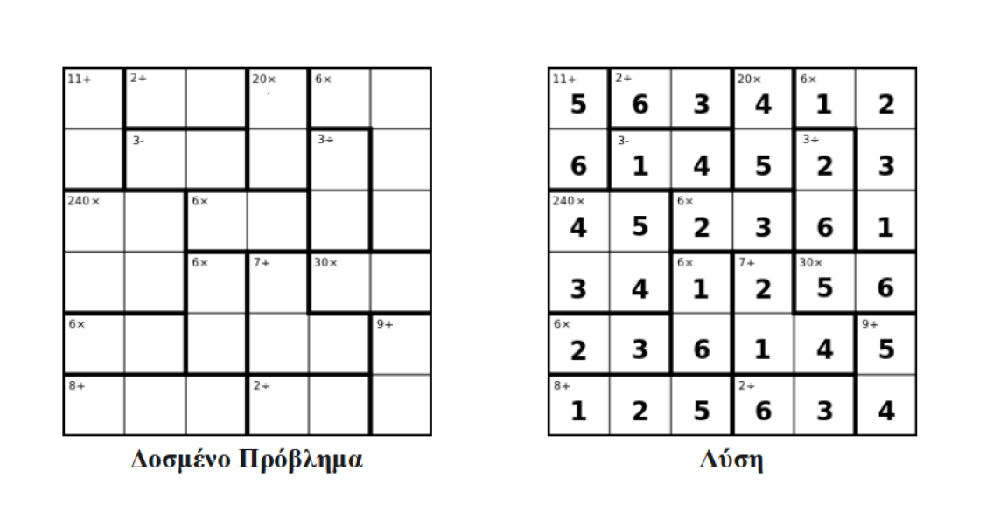

In this README document we explain how to use and run the `kenken.py` in order to solve the [Kenken Puzzle](http://www.kenkenpuzzle.com). The format for the kenken puzzle is illustrated by the following example:

Suppose that the puzzle is the following:




Then the format for the input is the following:

```
6
11#0-6#+
2#1-2#/
3#7-8#-
20#3-9#*
6#4-5-11-17#*
3#10-16#/
240#12-13-18-19#*
6#14-15#*
6#20-26#*
7#21-27-28#+
30#22-23#*
6#24-25#*
9#29-35#+
8#30-31-32#+
2#33-34#/
```